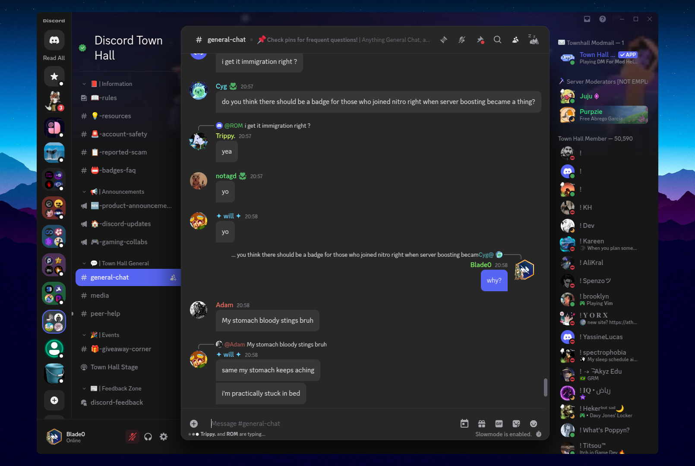

# Shine
Glossy, glassy theme based on [a twitter design.](https://x.com/zeealeid/status/1956781061116928462?)


    
 
|

Original design made by [@zeealeid](https://github.com/zeealeid)


## Installation

### Vencord

Download shine.theme.css and put it in your local themes.

If you have Vesktop, enable Native Discord Titlebar!

   
### BetterDiscord
download shine.theme.css and put it in your themes folder.

## Customization
The entire app can be recolored with nitro themes, Vencord's clienttheme plugin, or a single var: `--custom-theme-base-color`

I highly reccomend turning on send message button

## Development
deps: 
- nodejs
- npm
```
git clone https://github.com/Blade04208/shine.git
cd shine
npm i
npm start
```
add `http://localhost:5050/dev.css` to your quickcss or theme links and it should work! probably

# Contributing

you can contribute to either fix bugs, make faster, or make it closer-looking to the original twitpost
